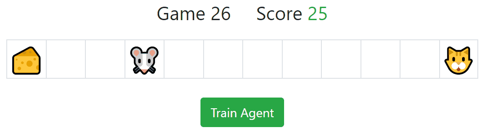

# Catch the Cheese
Turn based, 1D simple game, where AI agent based on Artificial Neural Network learns how to play the game on its own by using Q-Learning algorithm.  The goal of the game is to collect cheeses as much as possible avoiding cat.

<p align="center">
	
</p>

The code is well commented but requires initial knowledge of Reinforcement Learning. 

## Prerequisites

- NPM
- NodeJS

#### Optional:

- Chrome Browser
- Visual Studio Code
- Visual Studio Code Extensions:
  - Debugger for Chrome
  - Vetur


## Installing
```
npm install
```

## How to Run

### Compiles and hot-reloads for development
```
npm run serve
```
The command starts  dev server at http://localhost:8080/.
> `F5` in Visual Studio Code opens up http://localhost:8080/ in chrome browser.

### Compiles and minifies for production
```
npm run build
```
Compiles project into `/dist` folder